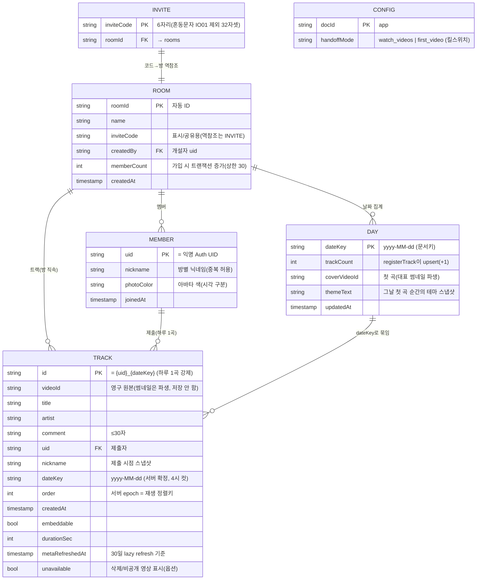

# ERD (데이터 모델 설계) — v2

> **정본:** [백엔드설계.md §2](백엔드설계.md) — 이 문서는 그 스키마를 시각화·해설한다.
> **스택:** React Native (Expo) + Firebase. **쓰기는 전부 Cloud Functions 경유, 클라이언트는 읽기 전용.**
> 구버전(네이티브 SwiftUI·클라 직접쓰기) 데이터 모델은 폐기됨 — [기능명세서](기능명세서.md) 상단 배너 참고.

---

## 1. 엔티티 관계도



---

## 2. 컬렉션 계층 (물리 경로)

```
config/app                                    전역 원격 설정 (콘솔 수동, 읽기 public)
invites/{inviteCode}  → { roomId }            코드→방 역참조 (유일성 보장 지점)

rooms/{roomId}                                방
├─ members/{uid}                              멤버 (문서키 = 익명 UID)
├─ tracks/{uid_dateKey}                       트랙 (방 직속, 문서키 = uid_dateKey)
└─ days/{dateKey}                             날짜별 집계 (과거 목록 탭 데이터 소스)
```

> `themes` 컬렉션은 **없다.** 오늘 테마는 클라가 `themeFor(todayKey())`로 결정론적 계산(내장 풀+해시),
> 과거 테마만 `days.themeText` 스냅샷을 읽는다([구현계획서 §2](구현계획서.md)).

---

## 3. 핵심 설계 결정 (Why)

| 결정 | 이유 |
|---|---|
| **쓰기는 전부 Cloud Functions 경유, 클라는 읽기 전용** | 하루 1곡·서버 dateKey·코드 유일성 등 핵심 규칙을 클라가 우회 못 하게 하는 가장 단순한 방법. Security Rules는 "읽기 권한"에만 집중. |
| **트랙 ID = `{uid}_{dateKey}` + create-only** | (방·날짜·사용자)당 문서 1개만 가능 → **하루 1곡을 물리적으로 강제**. 재등록은 `already-exists`. |
| **`dateKey`는 서버 시각으로 확정 (새벽 4시 컷)** | `dateKey = (now − 4h)`의 KST 날짜. 밤샘 감상 패턴 존중 + 클라 시계 조작 방지. 롤오버는 배치 없이 쿼리 시프트 하나. |
| **`order` = 서버 epoch** | 재생 정렬키를 서버가 부여 → 클라가 순서를 위조할 수 없음. 인덱스: tracks `dateKey ASC + order ASC`. |
| **초대코드 = 6자리 + `invites/{code}` 역참조** | Firestore는 필드 unique 제약이 없음 → `invites/{code}` 문서 **트랜잭션 create**로 유일성 확보(충돌 시 재생성). 공유 텍스트에 코드 병기·딥링크 없이 베타 가능. 32⁶≈10억 조합. |
| **`days` 집계 문서** | Firestore는 "tracks에 존재하는 dateKey 목록"을 distinct로 못 뽑음 → 첫 곡 등록 시 Functions가 days를 만들어 날짜 탭·과거 목록·대표 썸네일을 쿼리 1번으로 해결. |
| **썸네일 URL 미저장** | `videoId`가 유일한 영구 원본, 썸네일은 파생. URL을 따로 저장하면 videoId와 어긋남(실제 발생). `days`도 `coverVideoId`만. |
| **`themeText`는 첫 곡 순간 스냅샷** | 내장 테마 풀이 나중에 바뀌면 해시 결과가 달라져 과거 테마가 소급 변조됨 → 과거는 스냅샷 고정. 첫 생성 때만 기록, 이후 덮어쓰지 않음. |
| **닉네임 방별·중복 허용** | 같은 사람이 방마다 다른 닉네임 가능. uid로 구분, `photoColor`로 시각 구분. |

---

## 4. 쓰기 경로 = Cloud Functions (callable, asia-northeast3)

> 클라이언트는 어떤 컬렉션에도 직접 쓰지 못한다. 모든 변경은 아래 함수(Admin SDK)를 통한다.

| 함수 | 대상 문서 | 핵심 처리 |
|---|---|---|
| `createRoom` | `invites/{code}`, `rooms`, `members` | 6자 코드 생성 → invites 트랜잭션 create(유일성) → 방+방장 멤버 생성 |
| `joinRoom` | `members/{uid}`, `rooms.memberCount` | invites 조회 → 인원 상한(30) 검사 → 멤버 set(멱등) + memberCount 증가 |
| `registerTrack` | `tracks/{uid_dateKey}`, `days/{dateKey}` | 멤버 검증 → 서버 dateKey → `videos.list` 검증 → 트랙 create(중복=already-exists) → days upsert(trackCount+1, 첫 곡이면 cover·theme) |
| `updateTrack` | `tracks/{uid_dateKey}` | 본인+당일만, videoId 변경 시 재검증 |
| `deleteTrack` | `tracks`, `days.trackCount` | 본인+당일만, trackCount−1 (**0이면 days 문서 삭제** — 빈 날짜 탭 방지) |
| `refreshMeta` | `tracks` | `metaRefreshedAt` 30일 경과분만 oEmbed 재조회(0유닛), 404면 `unavailable=true` |

---

## 5. Security Rules 요약 (읽기 전용 모델)

| 경로 | read | write |
|---|---|---|
| `config/app` | public | deny (콘솔 수동) |
| `invites/{code}` | 인증 사용자 | deny |
| `rooms/{roomId}` 및 하위 members·tracks·days | 같은 방 멤버(`isMember`) | **전부 deny** |

> **모든 쓰기는 deny → Admin SDK(Functions)만 통과.** 상세 초안은 [백엔드설계.md §4](백엔드설계.md).
> `isMember`는 read당 `exists()` 1회 비용 — MVP 규모에선 무시 가능.

---

## 6. 알려진 정합성 이슈 (구현 시 주의)

> v2 ERD 리뷰(2026-07-14)에서 도출. 대부분 **비정규화된 파생/집계 필드**에서 발생 — `thumbnailUrl`을 없애며 경계한 바로 그 부류다. registerTrack·joinRoom·deleteTrack를 트랜잭션으로 짤 때 함께 반영할 것.

### 🔴 구현 전 확정 (카운터/집계 정합성)

| # | 이슈 | 대응 |
|---|---|---|
| V1 | **`deleteTrack`가 `coverVideoId`를 유지 안 함** — 대표(첫) 곡을 지우고 다른 곡이 남으면 `coverVideoId`가 사라진 videoId를 계속 가리켜 대표 썸네일이 깨짐 | 삭제 대상 == `coverVideoId`면 남은 최소 `order` 트랙으로 재계산 |
| V2 | **`days` 집계 원자성** — `tracks` 쓰기와 `trackCount` 증감이 한 트랜잭션이 아니면 드리프트 → "trackCount 0이면 day 삭제" 로직이 곡 남은 날을 증발시키거나 빈 날짜 탭을 남김 | track 쓰기 + day 집계를 **하나의 Firestore 트랜잭션**으로 |
| V3 | **`joinRoom`의 `memberCount` 멱등성 결여** — 같은 uid 재입장 시 `members.set`은 멱등이나 `memberCount++`는 매번 증가 → 실제 인원보다 먼저 30 캡에 걸림 | 트랜잭션 안에서 **member 문서가 없던 경우에만** 증가. `members`가 진실, `memberCount`는 캐시 |

### 🟠 자기모순 / 정책

| # | 이슈 | 대응 |
|---|---|---|
| V4 | **`photoColor` 저장 + 클라 파생 중복** — 닉네임 해시로 결정론적 파생 가능한데 저장까지 함. 재입장으로 닉네임 바뀌면 어긋남 | 저장 대신 닉네임에서 파생(권장) 또는 클라 파생 제거하고 서버 값만 신뢰 |
| V5 | **`refreshMeta` 열람-lazy → 안 본 날은 30일 갱신 정책 미준수** ([유튜브연동설계 §6](유튜브연동설계.md) 준수 주장과 상충) | 스케줄드 스윕(Cloud Scheduler) 추가 or "미준수 감수" 명시 |
| V6 | **초대코드 2중 저장**(`rooms.inviteCode` + `invites` 키) + 회전/만료 경로 부재 | 회전 불필요면 명시, 필요하면 트랜잭션 경로 설계 |

### 🟡 시맨틱 / 경미

- **V7** `Track.artist`에 채널명 저장 — 채널 ≠ 아티스트. `channelTitle`로 명명하거나 부정확성 수용.
- **V8** `order = 서버 epoch(ms)` — 동일 ms 동값(희박), delete 후 재등록 시 순서 맨 뒤로 이동.
- **V9** 핸드오프 50곡 ↔ 멤버 30캡 암묵 결합 — 캡을 50 초과로 올리면 `watch_videos`가 깨짐. 불변식을 상수로 못박기.
- **V10** 스키마 3중 존재(백엔드설계 §2 · `models.ts` · ERD.md) — `models.ts`를 유일 정본으로, 문서는 포인터만.

---

## 7. 향후 (MVP 외)

- **신고/모더레이션(FR-18):** `reports/{trackId}_{reporterUid}`(dedupe) + 임계치 초과 시 Function이 `tracks.unavailable=true` 세팅. 아직 스키마 미반영.
- **리액션:** `tracks/{id}/reactions` 서브컬렉션 확장 여지만 예약([구현계획서 §6](구현계획서.md)).
- **계정 영속:** 익명 uid는 앱 삭제 시 소멸 → 고도화 때 Sign in with Apple `linkWithCredential`.
