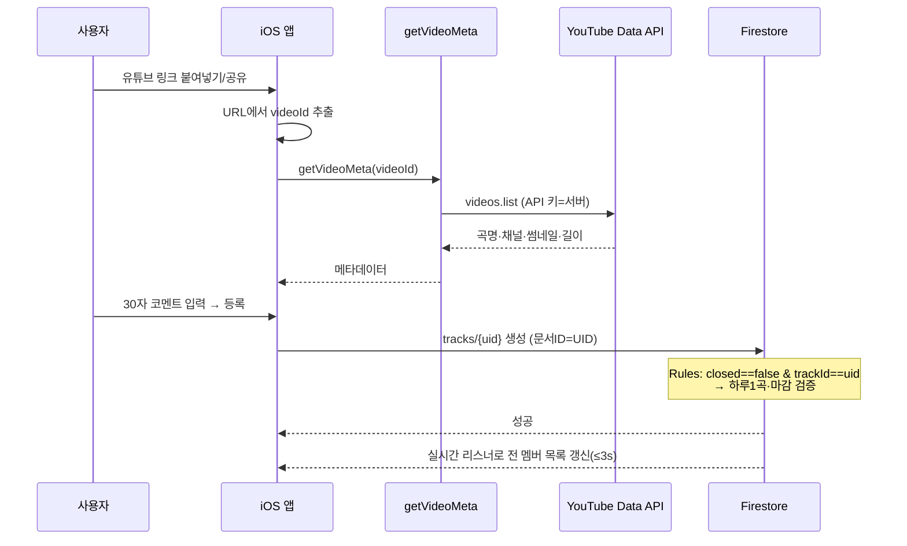
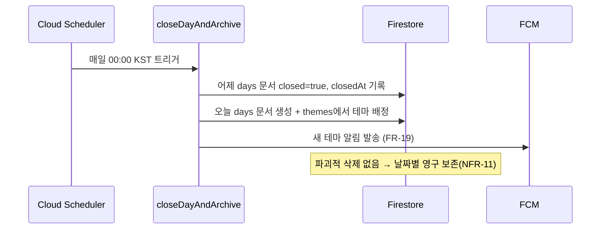

# 시스템 아키텍처 (System Architecture)
## MUZIK IS MY LIFE

> ⚠️ **WIP — 구버전(SwiftUI/BaaS) 기반 초안.** 아직 v2(React Native + Cloud Functions 쓰기)로 재작성하지 않았다.
> App Clip·IFrame 중심 재생·자정 마감·`getVideoMeta`·`themes` 컬렉션 등은 v2에서 바뀜(핸드오프 재생·새벽 4시·registerTrack).
> 데이터 모델 정본은 [ERD.md](ERD.md) · [백엔드설계.md](백엔드설계.md). 이 문서의 v2 재작성은 후속 작업.

> 클라이언트(iOS 네이티브 + App Clip)와 Firebase(BaaS) 중심의 서버리스 구성.
> 서버 구현을 최소화(BaaS)하되, 보안이 필요한 지점(YouTube API 키·마감)만 Cloud Functions로 프록시한다.

---

## 1. 전체 구성도

```mermaid
flowchart TB
    subgraph Client["📱 클라이언트 (iOS 16+)"]
        App["정식 앱\n(SwiftUI)"]
        Clip["App Clip\n(게스트 입장)"]
        Player["IFrame Player\n(youtube-ios-player-helper)"]
        App -.코어 로직 공유.- Clip
    end

    subgraph Firebase["☁️ Firebase (BaaS)"]
        Auth["Anonymous Auth"]
        FS[("Firestore\n실시간 DB")]
        AppCheck["App Check\n(남용 방지)"]
        subgraph CF["Cloud Functions"]
            GetMeta["getVideoMeta()\nYouTube 메타 프록시"]
            CloseDay["closeDayAndArchive()\n자정 마감·테마 배정"]
        end
        Sched["Cloud Scheduler\n매일 00:00 KST"]
        FCM["FCM\n푸시 알림"]
    end

    subgraph External["🌐 외부"]
        YTData["YouTube Data API v3"]
        YTPlay["YouTube IFrame\n(스트리밍)"]
        AASA["Universal Link\napple-app-site-association"]
    end

    Clip -->|초대 링크 라우팅| AASA
    App --> Auth
    Clip --> Auth
    App -->|실시간 리스너/쓰기| FS
    Clip -->|실시간 리스너/쓰기| FS
    App --> AppCheck
    App -->|videoId| GetMeta
    GetMeta -->|API 키(서버 보관)| YTData
    Sched --> CloseDay
    CloseDay --> FS
    CloseDay --> FCM
    FCM -.->|알림| App
    Player --> YTPlay
    FS -.보안 규칙.- AppCheck
```

---

## 2. 레이어 책임

| 레이어 | 책임 | 기술 |
|---|---|---|
| **표현(View)** | 화면·상호작용 | SwiftUI, 디자인 시스템(`MuzikColor/Font/Layout`) |
| **상태/도메인** | 실시간 구독, 하루1곡 판정, 재생 큐 | `@Observable`/ViewModel, Firestore 리스너 |
| **데이터 액세스** | Firestore CRUD, 트랜잭션 | Firebase SDK (SPM) |
| **인증** | 익명 UID 발급 | Anonymous Auth |
| **서버 로직** | 보안 필요 작업만 | Cloud Functions (Node) |
| **스케줄** | 자정 마감 트리거 | Cloud Scheduler |
| **보안 경계** | 접근 제어 · 클라 위조 차단 | Security Rules + App Check |

> **원칙:** 읽기/쓰기는 클라이언트가 Firestore에 직접(BaaS) → 실시간·저지연(NFR-01).
> Cloud Functions는 **비밀(YouTube 키)·신뢰(마감)** 가 필요한 작업만 담당(NFR-04).

---

## 3. 핵심 흐름 — 곡 등록 (F3)



---

## 4. 핵심 흐름 — 자정 마감 & 아카이브 (F6)



---

## 5. 아키텍처 결정 (ADR 요약)

| 결정 | 대안 | 선택 이유 |
|---|---|---|
| **BaaS 직결(Firestore) + 최소 함수** | 전통적 API 서버 | 3인·1개월·실시간 요구 → 서버 구현 최소화가 합리적. |
| **YouTube 호출을 Cloud Function 프록시** | 클라에서 직접 호출 | API 키 클라 노출 금지(NFR-04) + 쿼터 단일 관리·캐싱(C-03). |
| **App Clip으로 게스트 입장** | 웹뷰/일반 딥링크 | 설치·가입 없이 5초 내 입장(FR-04, NFR-02). iOS 전용 제약(C-02). |
| **IFrame Player 화면 노출 재생** | 오디오 백그라운드 추출 | YouTube 약관·심사 준수(NFR-09). |
| **각 기기 독립 재생** | 서버 재생 동기화 | 구현 단순·심사 안전. 동기 재생은 범위 밖(FR-13). |
| **App Check 적용** | 없음 | 비정상 클라의 함수/DB 남용 차단(NFR-06). |

---

## 6. 확장 여지 (향후)

- **메타데이터 캐싱:** `getVideoMeta` 결과를 Firestore/Functions 캐시에 저장 → 쿼터 절감(C-03).
- **신고 모더레이션:** `reports` 컬렉션 + 임계치 초과 자동 숨김 Function(FR-18).
- **수익화:** 외부 플랫폼 내보내기·플레이어 스킨(단건 결제) — 스트리밍 유료화 불가(C-01).
