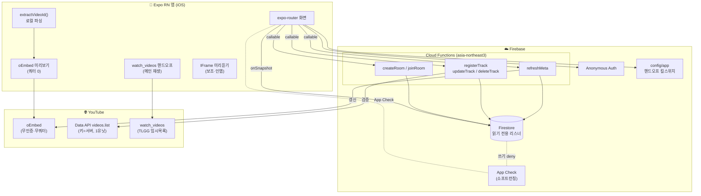
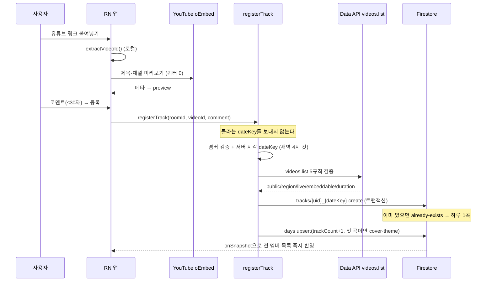
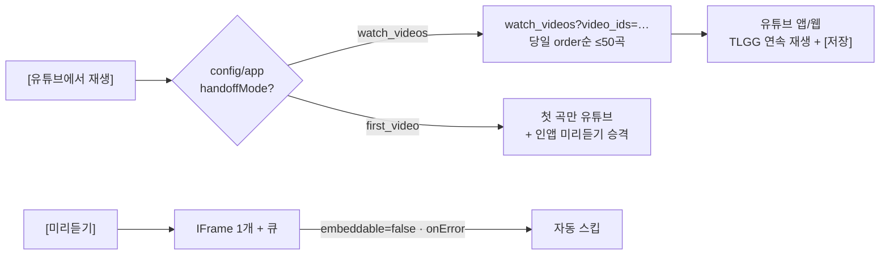

# 시스템 아키텍처 (System Architecture) — v2

> **스택:** React Native (Expo) + Firebase. **쓰기는 전부 Cloud Functions(Admin) 경유, 클라이언트는 읽기 전용.**
> 데이터 모델 정본은 [ERD.md](ERD.md) · [백엔드설계.md §2](백엔드설계.md). 재생·연동 상세는 [유튜브연동설계.md](유튜브연동설계.md).

---

## 1. 전체 구성도

---

## 2. 레이어 책임

| 레이어 | 책임 | 기술 |
|---|---|---|
| **화면/라우팅** | 화면·모달·딥링크 | expo-router (`app/`) |
| **상태** | 세션·방 상태, 실시간 구독 | zustand 2스토어(`session`/`room`), `onSnapshot` |
| **검증** | 폼·입력 계약 (클라·서버 공유) | zod (`src/schemas/`) |
| **전송 경계** | 함수 호출 단일 지점 | `src/lib/api.ts` (callable) |
| **인증** | 익명 UID | Anonymous Auth (`initializeAuth` + AsyncStorage 영속) |
| **서버 로직** | 모든 쓰기·검증·서버 dateKey | Cloud Functions (Admin SDK) |
| **보안 경계** | 읽기 권한만 관리, 쓰기 전면 deny | Security Rules + App Check |

> **대원칙:** 하루 1곡·서버 dateKey·코드 유일성 등 핵심 규칙을 클라가 우회 못 하게 **쓰기를 Functions로 단일화**.
> Security Rules는 "읽기 권한"에만 집중([백엔드설계.md §4](백엔드설계.md)).

---

## 3. 핵심 흐름 — 곡 등록 (유일한 쓰기 경로)

> `already-exists`는 에러가 아니라 "오늘 이미 올림 → [수정하기]"로 분기([곡등록설계.md §6](곡등록설계.md)).

---

## 4. 핵심 흐름 — 재생 (유튜브 핸드오프 + 킬스위치)

- **핸드오프가 메인** → 화면 꺼짐 정지·"유튜브 대체 앱" 심사 리스크를 핵심 경험에서 제거([유튜브연동설계.md §3](유튜브연동설계.md)).
- **킬스위치**: `watch_videos`(비공식)가 막히면 `config/app` 문서 수정만으로 **배포 없이** `first_video` 폴백.
- **각 기기 독립 재생** — 서버 재생 동기화 없음.

---

## 5. 아키텍처 결정 (ADR 요약)

| 결정 | 이유 |
|---|---|
| **쓰기 = Cloud Functions 단일화** | 하루1곡·서버 dateKey·코드 유일성을 클라가 우회 불가. Rules는 읽기 전용이라 단순. |
| **재생 = watch_videos 핸드오프** | 무인증·무쿼터 연속 재생 + 유튜브 [저장] 무료 제공. 심사·쿼터·백그라운드 리스크 회피. `playlists.insert`(50유닛/OAuth) 영구 제외. |
| **메타 = oEmbed(표시) + videos.list(검증) 분리** | 미리보기는 쿼터 0의 oEmbed로 체감지연 제거, 검증만 1유닛 Data API. 키는 Functions에만. |
| **초대 = 6자 코드 + `invites/{code}` 역참조** | Firestore 필드 unique 부재 → invites 문서 트랜잭션 create로 유일성. 딥링크 없이 코드 병기로 베타 가능. |
| **dateKey = 서버 시각, 새벽 4시 컷** | 밤샘 감상 패턴 존중 + 클라 시계 조작 방지. 마감은 배치 없이 쿼리 시프트. |
| **테마 = 내장 풀 + dateKey 해시(서버리스)** | `themes` 컬렉션 제거. 오늘은 클라 계산, 과거는 `days.themeText` 스냅샷. |
| **킬스위치 `config/app`** | `watch_videos` 비공식 엔드포인트 차단 대비 무배포 폴백. |
| **App Check는 소프트런칭에 활성** | 비정상 클라의 함수 남용 차단. MVP 개발 속도 위해 초기엔 미적용. |

---

## 6. 남은 위험

- **`watch_videos` 비공식** → 3단계 폴백 체인(핸드오프 → first_video → 인앱 IFrame 메인), M3 킬스위치 전환 테스트([구현계획서 §5](구현계획서.md)).
- **익명 계정** → 앱 삭제 시 uid 소멸. 로컬 백업 코드로 재입장 유도, 고도화 때 Sign in with Apple 연결.
- **데이터 정합성** → 함수의 집계/카운터 유지 로직에 주의점 있음: [ERD.md §6 알려진 정합성 이슈](ERD.md) 참고.
